## For Question 1 to Question 4 please check Homework09.ipynb ##


## For Question 5 ##

*Testing this file locally with ipython after converting the notebook to script and doing required changes for lambda deployement and invoking the function from this file.*

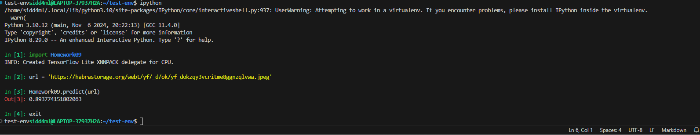

*Pulled the Docker image*

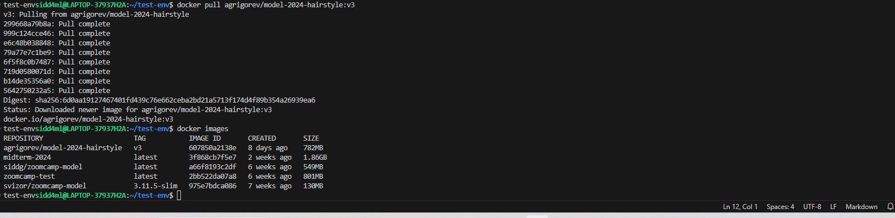

**So we can see that the size of the base image is 782MB**

## For Question 6 ##

*Created the Dockerfile*

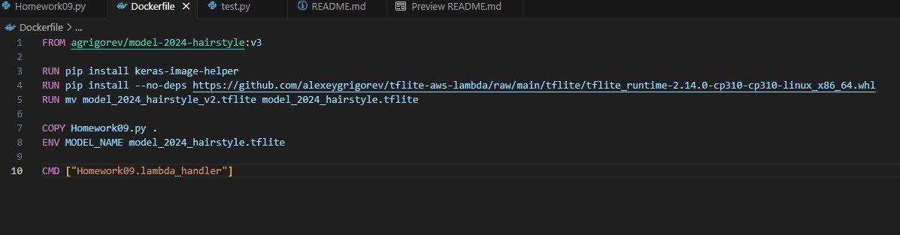

*And built the image*

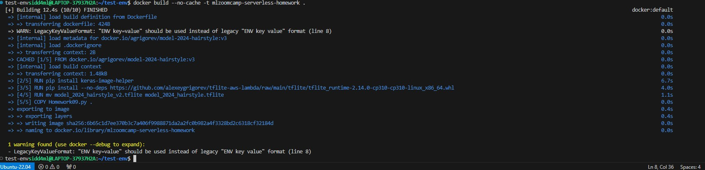

*Built Docker image showing on list*

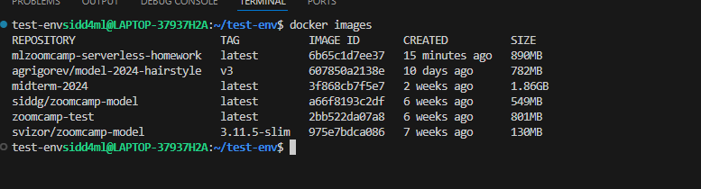

*Created a test.py script for testing the model within the image to be run inside Docker*

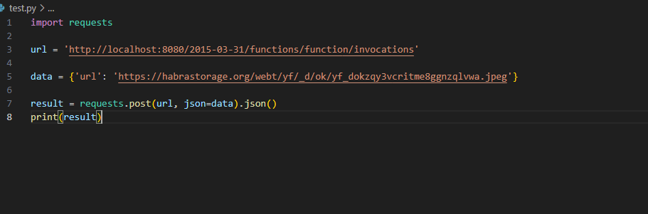

*Ran the Docker image and executed the test.py*

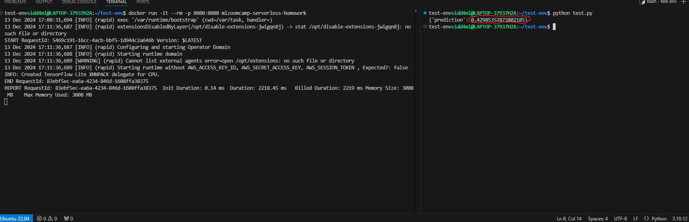

**So we can see that the output of the model is 0.429**


## Publishing it to AWS ##

 ### Publishing the image to ECR ###

 - ### Install awscli ###

 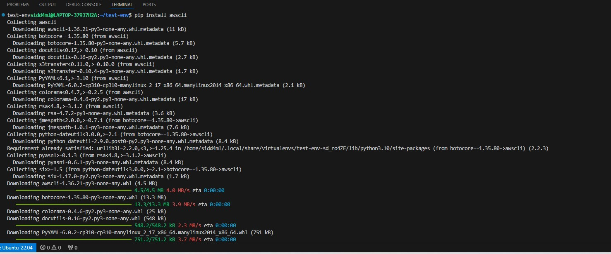

 - ### Create AWS Elastic Container Registry repository and log in to the same. You may have to configure with ```aws configure``` prior to this, if not done already. ###

 

 - ### AWS ECR repository created ###

 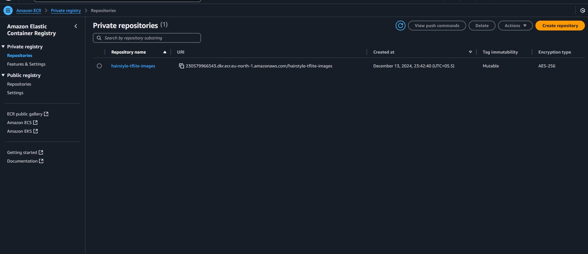

 - ### Set the variables for REMOTE_URI to the ECR ###

 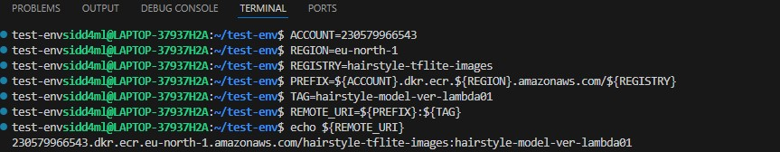

 - ### Tag the Docker image built on the local machine and push it to the ECR ###

 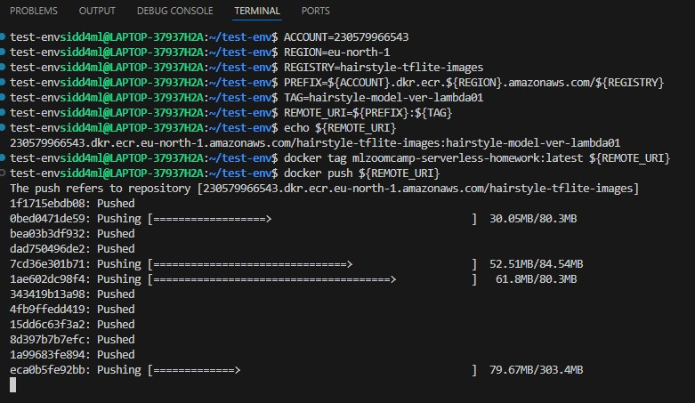

 - ### The image would be pushed to the ECR repository ### 
 
 

 - ### Pushed image showing in the ECR at AWS ###

 


 ### Creating a lambda function in AWS, using the ECR image ###
 
 - ### Create the AWS Lambda function choosing options as below ###

 

 - ### Select the required container image from the ECR repository ### 

 

 - ### You should get the lambda function created shown as below ###

 


 ### Give it more RAM and increase the timeout and Test it ###

 - ### Edit basic settings to increase Memory to 1024 MB and timeout to 30 seconds ###

 

 - ### Finally testing the lammbda function by creating & saving a Test Event and testing it ###

 


 ### Expose the lambda function using API Gateway ###

 - ### Pull up AWS API Gateway section and first create a new REST API ###

 
 
 - ### Now create a Resource for the created API ###

 

 - ### Then choose a API action (POST in our case) for the created Resource ###

 

 - ### Subsequently, create a Method for the Resource ###

 

 - ### After Method is created, you shall get this. You can test the Method from here. ###

 .jpg>)

 - ### Now you can Deploy the API by creating a Stage ###

 

 - ### We can see the stage ('test' in our case) has been created and the URL for public access of the API is generated here. ###

 


 ### Testing the Lamda function with the API ###

 - ### A test script aws_test.py is created for testing the Lambda Function through the API from the gateway ###

 

 - ### As we can see from the above image, the test script executes successfully, calling the lambda function through tthe API ###


