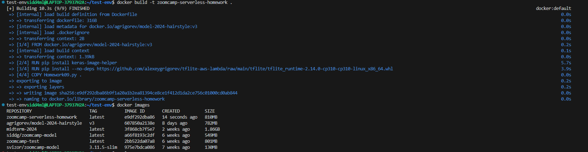
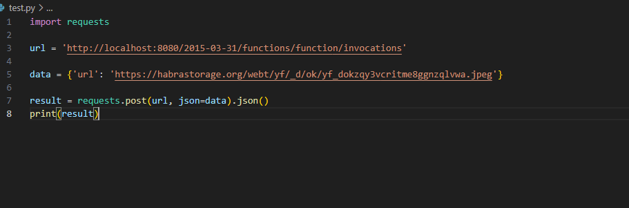
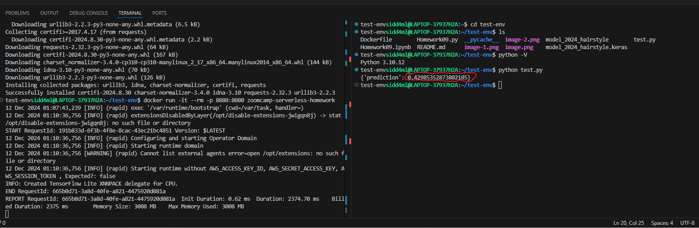

## For Question 1 to Question 4 please check Homework09.ipynb ##

## For Question 5 ##

*Testing this file locally with ipython after converting the notebook to script and doing required changes for lambda deployement and invoking the function from this file.*

*Pulled the Docker image*

**So we can see that the size of the base image is 782MB**

## For Question 6 ##

*Created the Dockerfile and built the image*

*Created a test.py script for test the model in the image to be run inside Docker*

*Ran the Docker image and executed the test.py*

**So we can see that the output of the model is 0.429**