# Homework 10 #

 ### *Building the Docker image as per instruction* ###

 

 ### *Question 1* ###

 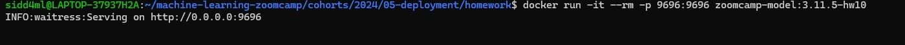

 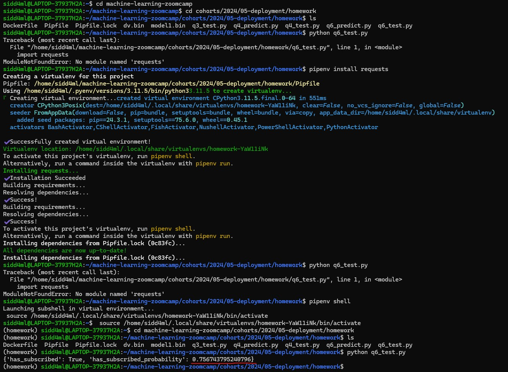

 

 ### *So we can see the value of probability is 0.757* ###

 ### *Question 2* ###

 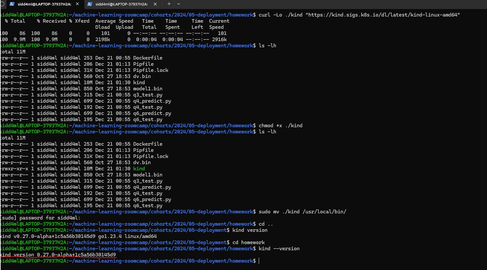

 ### *So we can see that the kind version is ```0.27.0-alpha+1c5a56b30145d9```* ###

 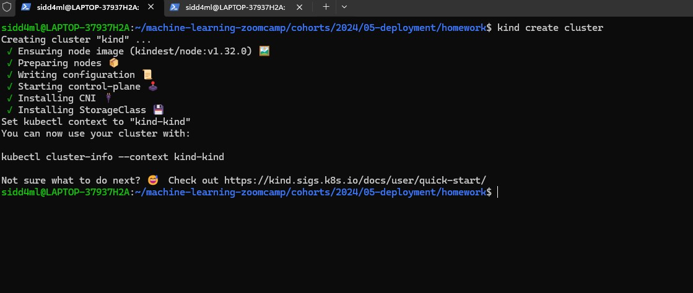

 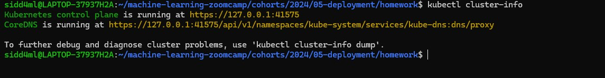

 ### *Question 3* ###

 > Pod is the smallest deployable computing unit that we can create and manage in Kubernetes (kind in our case)

 ### *Question 4* ###

 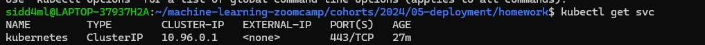

 ### *Question 5* ###
 
 

 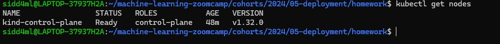

 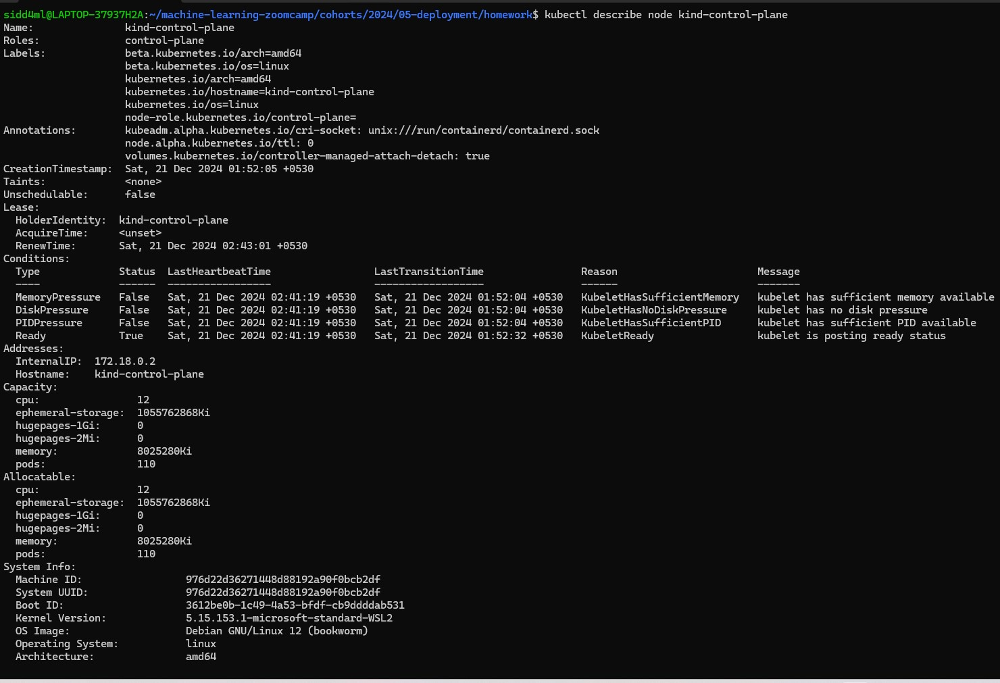

 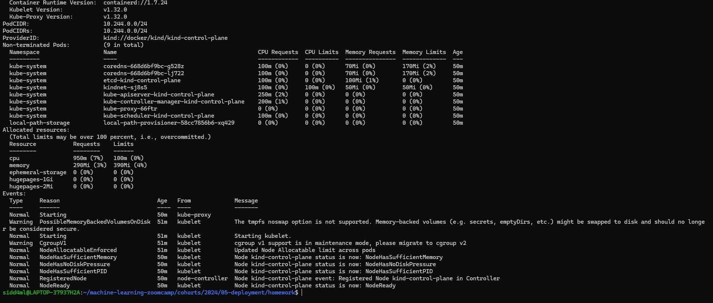


 ### *Question 6* ###
 
 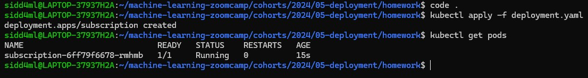

 ### *Question 7* ###
 
 

 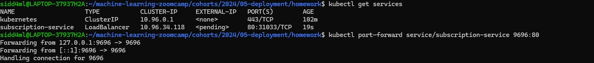

 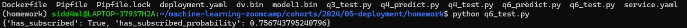
