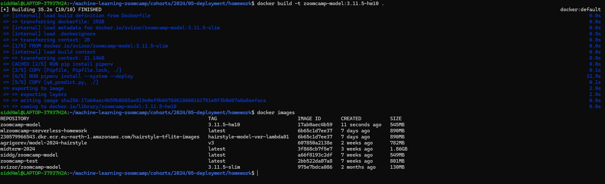
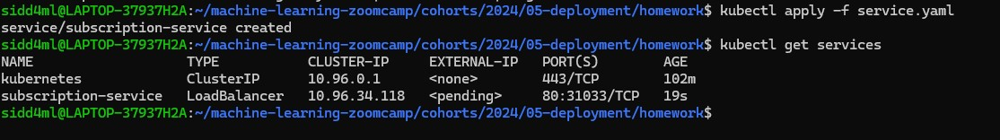

# Homework 10 #

 ### *Building the Docker image as per instruction* ###

 

 ### Question 1 ###

 

 

 

 #### *So we can see the value of probability is 0.757* ####

 ### Question 2 ###

 

 #### *So we can see that the kind version is ```0.27.0-alpha+1c5a56b30145d9```* ####

 

 

 ### Question 3 ###

  #### *Pod is the smallest deployable computing unit that we can create and manage in Kubernetes (kind in our case)* ####

 ### Question 4 ###

 

  #### *So we can see that the running service is of Type: ```ClusterIP```* ####

 ### Question 5 ###
 
 

 

 

 

 #### *So we can see that the command to upload the docker image is ```kind load docker-image <image-name>```* ####

 ### Question 6 ###
 
 

 #### *The selected value for port is ```9696```* ####

 ### Question 7 ###
 
 

  #### *The selected value for app in the service.yaml is ```subscription```* ####

 

 
